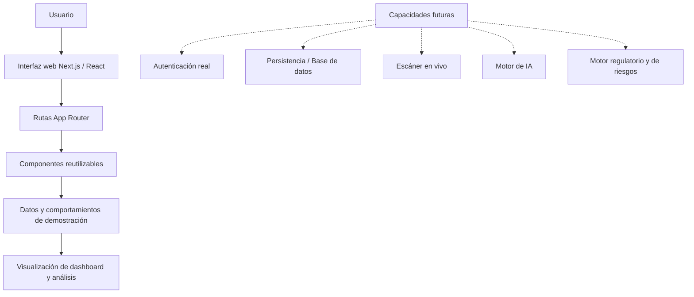

# PRIVACYOS — Arquitectura de Foundation

> Documento técnico basado en la estructura verificable de la rama `main`.
>
> Este documento describe el estado de Foundation y no presenta como implementadas las capacidades futuras de autenticación real, persistencia, escaneo en vivo, IA o motores de riesgo.

## 1. Alcance comprobado

La aplicación utiliza Next.js, React, TypeScript y Tailwind CSS. La estructura observada contiene:

- Rutas de marketing y autenticación bajo `app/`.
- Rutas del dashboard bajo `app/dashboard/`.
- Componentes reutilizables bajo `components/`.
- Archivos de configuración en la raíz.
- Un README que declara el uso de datos controlados de demostración.

## 2. Arquitectura lógica de Foundation

Las líneas discontinuas representan trabajo futuro declarado en el README, no integraciones verificadas como activas en Foundation.

## 3. Rutas observadas

- `/`
- `/login`
- `/register`
- `/dashboard`
- `/dashboard/scanner`
- `/dashboard/scanner/progress`
- `/dashboard/analyses`
- `/dashboard/analyses/[id]`
- `/dashboard/risks`
- `/dashboard/regulations`
- `/dashboard/rights`
- `/dashboard/profile`
- `/dashboard/settings`

## 4. Capas para la entrega académica

| Capa | Evidencia observable | Alcance en Foundation |
|---|---|---|
| Presentación | `app/`, `components/`, estilos globales | Implementada como interfaz web navegable |
| Aplicación | Rutas y componentes de interacción | Flujos visuales y datos controlados |
| Datos / servicios | README y configuración existente | No se debe declarar persistencia o servicios reales sin evidencia adicional |

## 5. Limitaciones declaradas

El README del repositorio indica que no están activos en esta fase la autenticación real, la base de datos, Prisma, el escáner, el motor de IA, el motor regulatorio, el motor de riesgos ni el cálculo productivo del Privacy Score.

## 6. Validaciones pendientes

No se declara que `npm install`, `npm run lint`, `npm run build` o una comprobación de TypeScript hayan sido ejecutados desde este entorno. Deben ejecutarse localmente o mediante un pipeline CI verificable antes de afirmar que el proyecto está validado.
