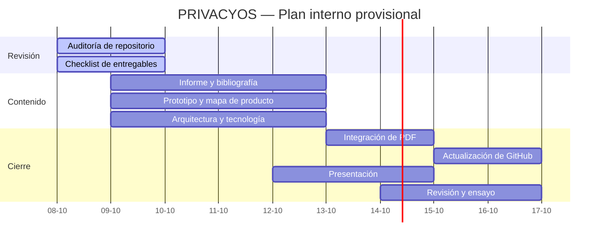

# PRIVACYOS — Carta Gantt y compromisos de trabajo

**Versión:** borrador operativo para revisión del equipo.  
**Última actualización:** 8 de octubre de 2026.  
**Importante:** las fechas de exposición del Hito 1 están pendientes de confirmación docente por la suspensión de clases informada por el equipo. Las fechas siguientes son una propuesta interna, no fechas oficiales de la asignatura.

## Plan de trabajo

| ID | Actividad | Responsable principal | Inicio propuesto | Fin propuesto | Dependencia | Estado |
|---|---|---|---|---|---|---|
| T1 | Auditar estructura, archivos, enlaces y seguridad del repositorio | Catalina Romero | 08-10-2026 | 09-10-2026 | — | En curso |
| T2 | Consolidar el checklist de entregables y detectar archivos faltantes | Simón Salgado | 08-10-2026 | 09-10-2026 | T1 | En curso |
| T3 | Completar y revisar problema, evidencia, usuario, propuesta de valor y citas del informe | Melisa Ibáñez | 09-10-2026 | 12-10-2026 | T2 | Pendiente |
| T4 | Revisar navegación del prototipo y completar mapa del producto | Catalina Romero | 09-10-2026 | 12-10-2026 | T1 | Pendiente |
| T5 | Revisar diagrama de arquitectura, decisión tecnológica y SPA/MPA | Simón Salgado | 09-10-2026 | 12-10-2026 | T1, T2 | Pendiente |
| T6 | Integrar el informe y sus imágenes/diagramas en un PDF | Melisa Ibáñez | 12-10-2026 | 13-10-2026 | T3, T4, T5 | Pendiente |
| T7 | Incorporar documentos, diagramas y enlaces finales en GitHub | Catalina Romero | 13-10-2026 | 14-10-2026 | T6 | Pendiente |
| T8 | Preparar diapositivas y guion de cinco minutos | Simón Salgado | 12-10-2026 | 14-10-2026 | T3, T4, T5 | Pendiente |
| T9 | Revisión cruzada del repositorio y del informe por los tres integrantes | Los tres | 14-10-2026 | 15-10-2026 | T6, T7, T8 | Pendiente |
| T10 | Ensayo cronometrado y preparación de preguntas individuales | Los tres | 15-10-2026 | 16-10-2026 | T8, T9 | Pendiente |
| T11 | Ajustar fecha de presentación/entrega según indicación oficial del docente | Simón Salgado coordina | Por confirmar | Por confirmar | Aviso del docente | Bloqueado por confirmación |

## Vista resumida

## Acuerdos de gestión

1. Las fechas son propuestas internas y deben ser aceptadas por el equipo; no sustituyen el calendario oficial del curso.
2. Si el docente comunica una nueva fecha, se actualizarán las tareas afectadas y sus dependencias.
3. Cada responsable debe dejar evidencia del avance en GitHub (archivo, commit, enlace o registro de validación).
4. Las tareas bloqueadas deben comunicarse al equipo oportunamente.
5. Los tres integrantes revisarán los entregables antes de marcarlos como terminados.
6. No se registrarán reuniones, pruebas, firmas ni entregas que no hayan ocurrido.

## Registro de cambios

| Fecha | Cambio | Responsable |
|---|---|---|
| 08-10-2026 | Creación del borrador de planificación para ordenar pendientes del Hito 1 | Equipo PRIVACYOS |
